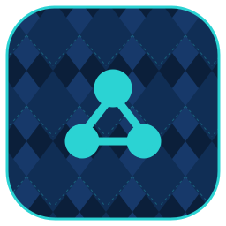

  

# agents

orca's base agent roster — the specialized subagents (wolf, otter, owl, crow, …), slash-commands, and hooks that give orca its personality and routing.

A first-party [orca](https://github.com/argyle-labs/orca) plugin (agents provider).

This is a **capability provider** — it contributes agents/commands/hooks into orca's composition registry. orca core carries **no embedded roster**: without this plugin loaded, orca has no agents to route to or materialize.

---

## What it does

A **hybrid** plugin with two seams:

- **Tool surface** — `agent.list` (names + descriptions) and `agent.get` (a named agent's full prompt), served over the orca-local MCP server.
- **AgentProvider backend** (`domain = "agents"`) — hands the embedded roster and slash-commands to orca's composition registry (`contract::agents`). This is what `orca install` materializes into `~/.claude/agents/*.md` + `~/.claude/commands/*.md`, and what the internal chat roster routes against.

The `.md` prompts under `src/agents/`, `src/commands/`, and `src/templates/` are embedded into the cdylib at build time.

## With orca

Load the plugin and orca composes its contributions automatically — nothing agent-specific is hardcoded in core. A later-registered provider (e.g. a per-profile override) wins on name collision, so this roster is a baseline you can override, not a ceiling.

Set `$ORCA_AGENTS_DIR` to a directory of `<name>.md` files to override individual agent prompts during development without rebuilding.

## Layout

- `src/` — the plugin (pure Rust): the `agent.*` tool surface + the `domain = "agents"` provider backend.
- `src/agents/`, `src/commands/`, `src/templates/` — the embedded `.md` prompts.
- `assets/` — plugin icon.
